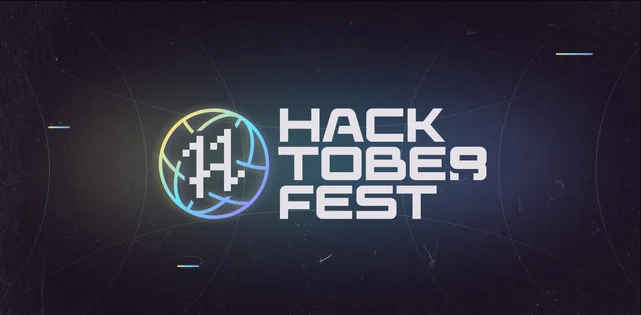

# JS-Project-Vault

### Open your first pull request for the Hacktoberfest 2022 challenge. 



<div align="center">

  [](http://makeapullrequest.com) [](https://github.com/ellerbrock/open-source-badges/)
</div>

<table align="center">
    <thead align="center">
        <tr border: 1px;>
            <td><b>Project Stats</td>
            <td><b>🌟 Stars</b></td>
            <td><b>🍴 Forks</b></td>
            <td><b>🐛 Issues</b></td>
            <td><b>🔔 Open PRs</b></td>
            <td><b>🔕 Close PRs</b></td>
        </tr>
     </thead>
    <tbody>
         <tr>
            <td><a href="https://github.com/19sajib/JS-Project-Vault"</a>Project</td>
            <td></td>
             <td></td>
            <td></td>
            <td></td>
           <td></td>
        </tr>
    </tbody>
</table>

# 🚀 How to get started?

You can refer to the following steps on the basics of Git and Github and also contact the Project Mentors, in case you are stuck:


#### If you don't have git on your machine, [install it](https://help.github.com/articles/set-up-git/).


## Fork this repository

Fork this repository by clicking on the fork button on the top of this page.
This will create a copy of this repository in your account.

## Clone the repository


Now clone the forked repository to your machine. Go to your GitHub account, open the forked repository, click on the code button and then click the _copy to clipboard_ icon.

Open a terminal and run the following git command:

```
git clone "url you just copied"
```

where "url you just copied" (without the quotation marks) is the url to this repository (your fork of this project). See the previous steps to obtain the url.


For example:

```
git clone https://github.com/your-github-username/JS-Project-Vault.git
```

where `your-github-username` is your GitHub username. Here you're copying the contents of the JS-Project-Vault repository on GitHub to your computer.

## Create a branch

Change to the repository directory on your computer (if you are not already there):

```
cd JS-Project-Vault
```

Now create a branch using the `git switch` command:

```
git switch -c your-new-branch-name
```

For example:

```
git switch -c add-js-project
```

## Make necessary changes and commit those changes

Now open file in a code editor, add your changes to it. And, save the file.

If you go to the project directory and execute the command `git status`, you'll see there are changes.

Add those changes to the branch you just created using the `git add` command:

```
git add .
```

Now commit those changes using the `git commit` command:

```
git commit -m "write about the changes you made"
```

## Push changes to GitHub

Push your changes using the command `git push`:

```
git push origin -u your-branch-name
```

replacing `your-branch-name` with the name of the branch you created earlier.

## Submit your changes for review

If you go to your repository on GitHub, you'll see a `Compare & pull request` button. Click on that button.


Now submit the pull request.


**Woo Hoo Yes** ! You have done it , You will get a notification email once the changes have been merged by maintainer.

## CONTRIBUTING A NEW PROJECT ?

### Please make sure you have followed to these guidelines

1. Create a folder with the name of your project

2. Start building inside your folder with an entry file called index.html and after building, attach an image named "preview.png" within the folder root which represents the preview image of your template(preview image should be in .png format only)

<h2 align=center> ✨ Contributors ✨ </h2>

 🚀 **Contributions** of any kind are welcome : Thanks go to these **Awesome People** 👨🏻‍💻

<table>
	<tr>
		 <td>
  		<a href="https://github.com/19sajib/JS-Project-Vault/contributors">
  			
  		</a>
		</td>
	</tr>
</table>

<hr>

Feel free to contribute to this repo.

### Show some ❤️&nbsp; by giving the star :star: to this repository!!
<h1 align=center> 🧠 Happy Hacking 🧠 </h1>